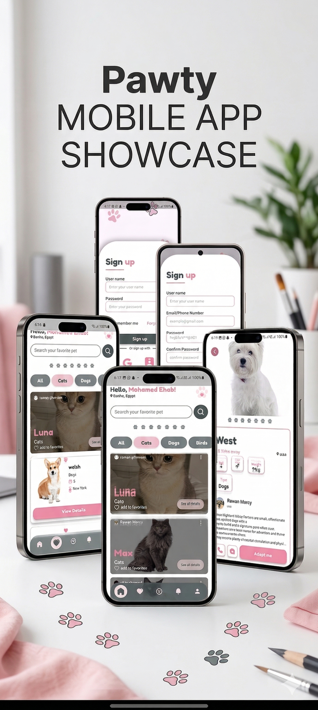
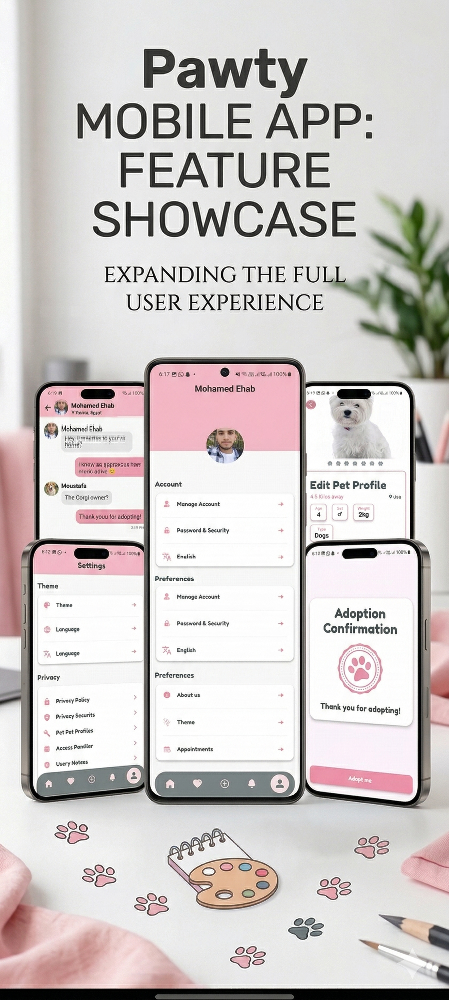
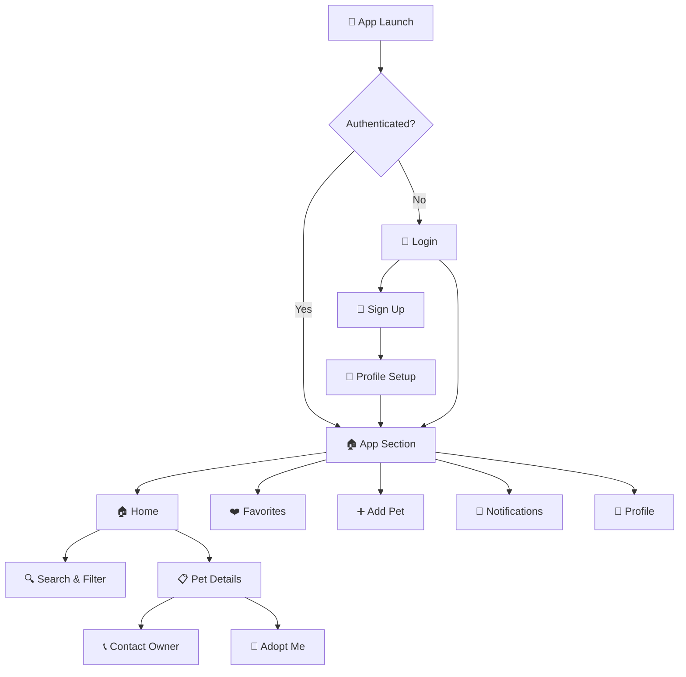

<p align="center">
  
</p>

<h1 align="center">🐾 Pawty</h1>

<p align="center">
  <b>Your Ultimate Pet Adoption Companion — Built with Flutter & Firebase</b>
</p>

<p align="center">
  
  
  
  
  
  
</p>

<p align="center">
  <i>Discover, adopt, and share adorable pets — all from a beautifully crafted mobile experience.</i>
</p>

---

## 📸 Screenshots

<p align="center">
  
  &nbsp;&nbsp;&nbsp;
  
</p>

---

## ✨ What is Pawty?

**Pawty** is a feature-rich, production-grade Flutter mobile application designed for **pet adoption**. It connects pet lovers with adorable animals (🐱 Cats, 🐶 Dogs, 🐦 Birds & more) looking for loving homes. With a stunning pink-themed UI, smooth animations, and a robust Firebase-powered backend, Pawty delivers a premium user experience from onboarding to adoption.

> Whether you want to **browse available pets**, **add your own pet for adoption**, **save favorites**, or **manage your profile** — Pawty has you covered.

---

## 🚀 Key Features

| Feature | Description |
|---|---|
| 🔐 **Authentication** | Full auth flow — Sign Up, Login, "Remember Me", profile setup with avatar upload |
| 🏠 **Home Feed** | Browse pets with search & category filters (All · Cats · Dogs · Birds) |
| 📋 **Pet Details** | Rich pet detail cards with age, sex, weight, type, owner info & adopt button |
| ➕ **Add Pet** | List your pet for adoption with image upload via camera/gallery |
| ❤️ **Favorites** | Save & manage your favorite pets with a single tap |
| 👤 **Profile** | Animated collapsible SliverAppBar with user info, settings & account management |
| 🎨 **Onboarding** | Beautiful onboarding screens to welcome new users |
| 🧭 **Floating Navigation** | Animated floating bottom nav bar with auto-hide on scroll |
| 🔔 **Notifications** | Notifications tab (ready for integration) |
| 🖼️ **Cached Images** | Network images are cached for blazing-fast performance |
| 📱 **Responsive** | Fully responsive across all screen sizes with `flutter_screenutil` |
| 🎭 **Custom Splash** | Native splash screen on both Android & iOS |

---

## 🏗️ Architecture

Pawty follows **Clean Architecture** with a strict separation of concerns, making the codebase highly maintainable, testable, and scalable.

```
lib/
├── main.dart                       # App entry point & BLoC providers
├── firebase_options.dart           # Firebase configuration
│
├── core/                           # Shared foundation layer
│   ├── constants/                  # App colors, font definitions
│   ├── extensions/                 # Dart extensions (SizedBox, Padding)
│   ├── helper/                     # Image picker helper
│   ├── network/                    # Sealed NetworkResult<T> class
│   ├── routers/                    # GoRouter configuration & route paths
│   ├── services/                   # Firebase Storage services
│   ├── storage_helper/             # SharedPreferences wrapper
│   ├── utils/                      # Styles, icons, images, validators
│   └── widgets/                    # 14+ reusable widgets
│
├── features/                       # Feature modules (Clean Architecture)
│   ├── auth/                       # 🔐 Authentication
│   ├── home/                       # 🏠 Home Feed
│   ├── details/                    # 📋 Pet Details
│   ├── add_pet/                    # ➕ Add Pet
│   ├── favorite/                   # ❤️ Favorites
│   ├── profile/                    # 👤 Profile
│   ├── onboarding/                 # 🎨 Onboarding
│   └── app_section/                # 🧭 Main Shell (NavBar + PageView)
│
└── shared/                         # Cross-feature shared components
    └── popup_form/                 # Reusable popup form with Cubit
```

### Each Feature Follows This Pattern:

```
feature/
├── data/
│   ├── model/                      # DTOs (Data Transfer Objects)
│   ├── *_services/                 # Firebase service layer
│   └── repo/
│       ├── data_source/            # Remote data source (contract + impl)
│       └── repository/             # Repository (contract + impl)
│
└── presentation/
    ├── view/                       # Screen-level widgets
    ├── view_model/                 # Cubits & States
    └── widgets/                    # Feature-specific widgets
```

---

## 🧩 Tech Stack

<table>
  <tr>
    <th>Category</th>
    <th>Technology</th>
    <th>Purpose</th>
  </tr>
  <tr>
    <td><b>Framework</b></td>
    <td>Flutter 3.29 / Dart 3.9</td>
    <td>Cross-platform mobile development</td>
  </tr>
  <tr>
    <td><b>State Management</b></td>
    <td>flutter_bloc / Cubit</td>
    <td>Reactive, predictable state management</td>
  </tr>
  <tr>
    <td><b>Navigation</b></td>
    <td>GoRouter</td>
    <td>Declarative routing with deep link support</td>
  </tr>
  <tr>
    <td><b>Backend</b></td>
    <td>Firebase (Auth + Firestore + Storage)</td>
    <td>Authentication, database, file storage</td>
  </tr>
  <tr>
    <td><b>Networking</b></td>
    <td>Sealed <code>NetworkResult&lt;T&gt;</code></td>
    <td>Type-safe success/error handling</td>
  </tr>
  <tr>
    <td><b>Responsive UI</b></td>
    <td>flutter_screenutil</td>
    <td>Adaptive layouts across screen sizes</td>
  </tr>
  <tr>
    <td><b>Image Caching</b></td>
    <td>cached_network_image_widget</td>
    <td>Performant image loading & caching</td>
  </tr>
  <tr>
    <td><b>Image Handling</b></td>
    <td>image_picker</td>
    <td>Camera & gallery image selection</td>
  </tr>
  <tr>
    <td><b>SVG Rendering</b></td>
    <td>flutter_svg</td>
    <td>Crisp vector icon rendering</td>
  </tr>
  <tr>
    <td><b>Animations</b></td>
    <td>flutter_spinkit + Custom</td>
    <td>Loading indicators & micro-animations</td>
  </tr>
  <tr>
    <td><b>Local Storage</b></td>
    <td>shared_preferences</td>
    <td>Persisting user preferences</td>
  </tr>
  <tr>
    <td><b>Form UI</b></td>
    <td>dotted_border</td>
    <td>Styled upload containers</td>
  </tr>
  <tr>
    <td><b>Dev Tools</b></td>
    <td>device_preview</td>
    <td>Test on any device form factor in dev</td>
  </tr>
  <tr>
    <td><b>Equality</b></td>
    <td>equatable</td>
    <td>Value-based equality for states</td>
  </tr>
</table>

---

## 🎨 Design System

| Element | Details |
|---|---|
| **Primary Color** | `#F191AC` — Signature Pawty Pink 🩷 |
| **Color Palette** | 5 custom pink shades, 3 greys, 2 blacks |
| **Typography** | [FredokaOne](https://fonts.google.com/specimen/Fredoka+One) for headlines • [Inter](https://fonts.google.com/specimen/Inter) for body text |
| **Icons** | Custom SVG icon set + [Iconly](https://pub.dev/packages/flutter_iconly) filled icons |
| **Decorations** | Paw-print separators 🐾, dotted upload borders, gradient overlays |
| **Navigation** | Floating pill-shaped bottom nav bar with animated transitions |

---

## 🛠️ Getting Started

### Prerequisites

- **Flutter SDK** `>=3.29.0`
- **Dart SDK** `>=3.9.0`
- A **Firebase project** with Auth, Firestore, and Storage enabled
- Android Studio / VS Code with Flutter plugin

### Installation

```bash
# 1. Clone the repository
git clone https://github.com/MohamedEhab17/bfcai-Pawty.git
cd bfcai-Pawty

# 2. Install dependencies
flutter pub get

# 3. Configure Firebase
#    Place your google-services.json (Android) and
#    GoogleService-Info.plist (iOS) in the correct directories.
#    Or use FlutterFire CLI:
flutterfire configure

# 4. Run the app
flutter run
```

### Environment Setup

Create a `.env` file in the project root if using `flutter_dotenv` for any API keys:

```env
# Add your environment variables here
API_KEY=your_api_key_here
```

---

## 📱 App Flow



---

## 📂 Core Widgets Library

Pawty includes **14+ production-ready reusable widgets** in `lib/core/widgets/`:

| Widget | Purpose |
|---|---|
| `CustomElevatedButton` | Styled primary action button |
| `CustomContainerFields` | Input field containers with decorations |
| `TextFormFieldHelper` | Rich text form fields with validation |
| `CustomDropdownMenuContainer` | Animated dropdown menus |
| `CustomBackground` | Paw-print background decorator |
| `CustomAuthOptions` | Social auth option buttons |
| `FavoriteButton` | Animated heart toggle |
| `PawsSeparator` | Paw-print divider decoration 🐾 |
| `CustomRichText` | Styled rich text builder |
| `CustomArrowBackWidget` | Consistent back navigation button |
| `CustomModalProgressHud` | Full-screen loading overlay |
| `TwoDividerSeparatedWithText` | "— OR —" style dividers |
| `CustomTitleWithDivider` | Section headers with line |
| `Toast` | Custom toast notification system |

---

## 🔒 Security & Best Practices

- ✅ **Repository Pattern** — Data sources are abstracted behind contracts
- ✅ **Sealed Classes** — Type-safe `NetworkResult<T>` for all network calls
- ✅ **Firebase Auth** — Industry-standard authentication with error handling
- ✅ **Input Validation** — Custom validators for all form fields
- ✅ **Singleton Services** — Firebase services use private constructor singletons
- ✅ **Environment Variables** — Sensitive keys stored via `flutter_dotenv`
- ✅ **DTO Pattern** — Clean data mapping with `fromJson` / `toJson`

---

## 👨‍💻 Authors

<p align="center">
  <b>Mohamed Ehab</b>&nbsp;&nbsp;•&nbsp;&nbsp;<b>Rawan Mohamed</b><br/>
  <i>Flutter Developers</i><br/><br/>
  <a href="https://github.com/MohamedEhab17">
    
  </a>
  &nbsp;&nbsp;
  <a href="https://github.com/rawanmorsy">
    
  </a>
</p>

---

## 📄 License

This project is licensed under the **MIT License** — see the [LICENSE](LICENSE) file for details.

---

<p align="center">
  
  &nbsp;
  <b>Made with ❤️ and Flutter</b>
  &nbsp;
  
</p>

<p align="center">
  <i>If you like this project, don't forget to ⭐ the repo!</i>
</p>
